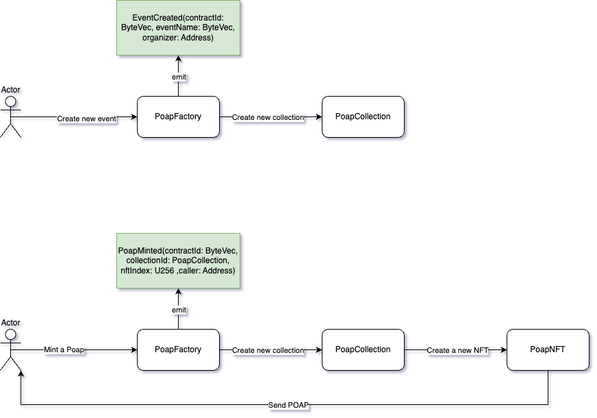

# Presence protocol



## Contracts fields

### PoapFactory

| Name                 | Type    | Description                         |
|----------------------|---------|-------------------------------------|
| collectionTemplateId | ByteVec | contract template id for collection |
| poapTemplateId       | ByteVec | contract template id for poap       |
| numMintedCollection  | U256    | how many events has been created    |

### PoapCollection

| Name          | Type    | Description                                                  |
|---------------|---------|--------------------------------------------------------------|
| nftTemplateId | ByteVec | Contract template id for poap                                |
| collectionUri | ByteVec | URI where the collection metadate are stored (ex: image)     |
| nftUri        | ByteVec | URI where the collection metadate are stored (ex: image)     |
| imageSvg      | ByteVec | SVG of an image, can be used to store small logo. Max 2.8 KB |
| maxSupply     | U256    | How many POAP can be minted                                  |
| mintStartAt   | U256    | When mint can start                                          |
| mintStopAt    | U256    | When mint will stop                                          |
| eventName     | ByteVec | Name of the event                                            |
| description   | ByteVec | Description of the event                                     |
| organizer     | Address | Address of the organizer, i.e creator of the event           |
| location      | ByteVec | Where the event is taking place                              |
| eventStartAt  | U256    | When the event starts                                        |
| eventEndAt    | U256    | When the event ends                                          |

### POAP

| Name         | Type    | Description                                                  |
|--------------|---------|--------------------------------------------------------------|
| collectionId | ByteVec | Collection id contract where the NFT is generated from       |
| nftIndex     | ByteVec | Index of the NFT, nft id                                     |
| uri          | ByteVec | URI where the nft metadata are stored (ex: image)            |
| image        | ByteVec | SVG of an image, can be used to store small logo. Max 2.8 KB |
| eventName    | ByteVec | Name of the event                                            |
| description  | ByteVec | Description of the event                                     |
| organizer    | Address | Address of the organizer, i.e creator of the event           |
| location     | ByteVec | Where the event is taking place                              |
| eventStartAt | U256    | When the event starts                                        |
| eventEndAt   | U256    | When the event ends                                          |

## Metadata format

Based on [IDynamicNFT](https://github.com/Deadrare/ANS/blob/main/contract/contracts/dynamic_nft/dynamic_nft_standard.ral)

```
Trait {
    traitType: b`Event Name`,
    value: eventName
},
Trait {
    traitType: b`Description`,
    value: description
},
Trait {
    traitType: b`Organizer`,
    value: toByteVec!(organizer)
},
Trait {
    traitType: b`Location`,
    value: location
},
Trait {
    traitType: b`Event Start At`,
    value: u256ToString!(eventStartAt)
},
Trait {
    traitType: b`Event End At`,
    value: u256ToString!(eventEndAt)
}
```

To be able to show the POAP on NFT platforms, explorer and wallets, the organizer needs to add a json file following the NFT format the chain is using.

### Collection
```json
{
  "name": "Alephium meetup",
  "description": "One of the many",
  "image": "<image file>"
}
```

### POAP

```json
{
  "name": "Alephium meetup",
  "image": "<image file>"
}
```
